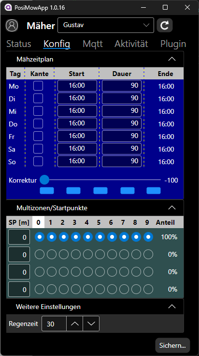

# Avalonia-Desktop-App
Eine portable Anwendung mit der man Mäher des Herstellers Positec von einem Desktop-PC beobachten und steuern kann.
Dazu gehören die Marken Worx Landroid, Kress Mission, Landxcape und Ferrex Smartmower.

## Installation
Voraussetzung ist die Installation der .NET Runtime 8 auf dem Desktop-System. Hinweise dazu bitte direkt bei Microsoft [Download .NET 8.0](https://dotnet.microsoft.com/en-us/download/dotnet/8.0) nachlesen.
Die ZIP-Datei aus dem Release bereich muss in einem für den Nutzer schreibbaren Ordner entpackt werden. In den Unterordnern Data, Trace und Plugins werden Anemlde-Daten, Protokolle usw. abgelegt.

## Kurzer Überblick über die Applikation

| Tab / Register | Beschreibung |
| --- | --- |
|  | Hier werden die vom Mäher gelieferten Informationen anschaulich dargestellt. Die Rohdaten sieht man übrigens im Tab **_Mqtt_**.  Der Zeitpunkt der Letzten Aktualisierung wird unterhalb des Mähers angezeigt. Eine Aktualisierung kann über den Poll-Button angestossen werden.  In der Zeile _Mähzeit_ wird diese seit dem letzten Messerwechsel angezeigt. Über den Button **_Setze 0_** kann dieser bestätigt werden (gemerkt in der Cloud). Die Zeile Statisik enthält die Gesamtwerte von Distanz und Arbeits-/Mähdauer. Die Buttons **_Start_**, **_Stopp_** und **_Heim_** dienen zur Steuerung des Mähers. Weitere Funktionen sind ggf. über den Button  verfügbar.|
| --- | --- |
|  | Im Tab **_Konfig_** erfolgt die Konfiguration des Mähers. In der Klappe **_Mähzeitplan_** werden pro Tag Kantenschnitt, Startzeit und Dauer direkt eingegeben werden. Die Endzeit wird aufgrund des Korrekturfaktors berechnet. Über die Korrektur wird der Mähplan gesamtheitlich verändert. Bei -100% wird nicht gearbeitet, bei +100% doppelt soviel. Die Buttons darunter erlauben Änderungen in 50%-Schritte. Über die Klappe **_Multizonen_** kann man Starpunkte für 10 umlaufende Ausfahrten konfigurieren. Der Mäher fährt die vorgegeben Meterr am BK entlang und biegt dann in die Fläche ab. Um wirkliche Zonen zu erzeugen muss man das BK an den Übergängen verengen. In der Klappe **_Weitere Einstellungen_** enthält die _Regenzeit_ welche der Mäher nach abtrocknen des Sensors noch in der Station verbleibt. Bei einem Wert von 0 ignoriert der Mäher den Regen. Bei neueren Modell kann hier auch das __Drehmoment_ angepasst werden. Der Button **_Sichern_** überträgt die Konfiguration zum Mäher. Die aufpoppende Meldung mit dem Json-Inhalt dient zu Diagnosezwecken.|

